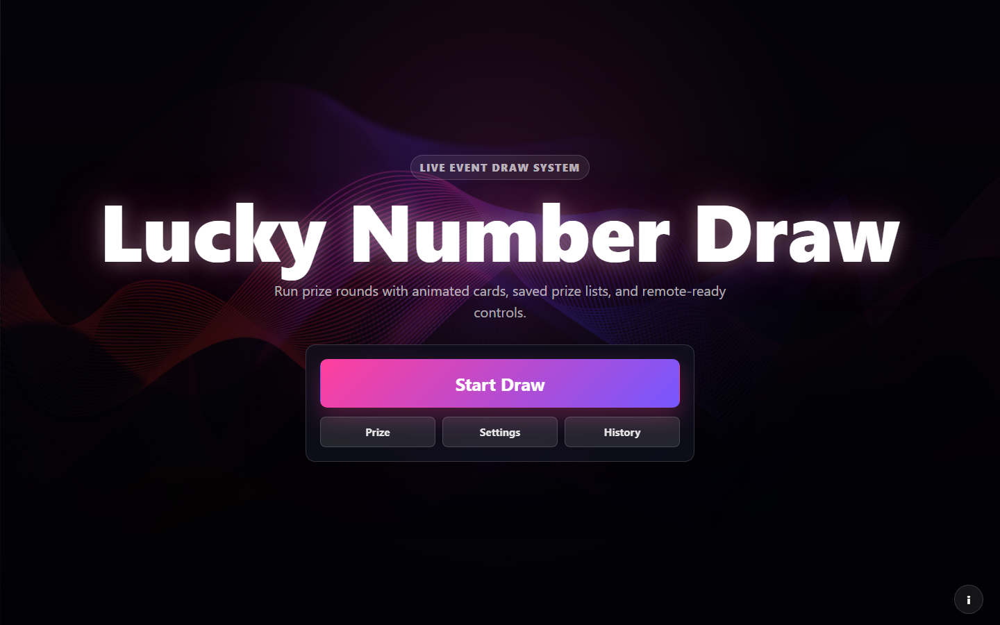

# Lucky Number Draw System

A browser-based lucky draw system for live prize events. It supports animated card reveals, reusable prize CSV lists, round-by-round winner tracking, history storage, keyboard shortcuts, and an optional remote controller.

## Live Demo

[https://splex7.github.io/lucky-number-draw/](https://splex7.github.io/lucky-number-draw/)

## Features

- **Modern event screen**: Neon stage-style start screen and animated card draw experience.
- **Prize setup panel**:
  - Custom event title
  - Draw ranges such as `1-500` or `1-442, 501-872`
  - Up to 2000 total numbers
  - Prize CSV editor using `Prize Name, Draw Count`
  - Saved prize lists using `localStorage`
  - Load, save, update, and delete CSV presets
- **Design & sound settings**:
  - Flip sound options using MP3 and generated HTML/Web Audio effects
  - Optional remote controller entry point
- **Round management**:
  - First-prize confirmation before starting
  - Fixed draw count display by default
  - Edit count only when needed
  - Balanced card grid with up to 8 cards per row
  - Automatic duplicate prevention across rounds
- **Results and history**:
  - Round-by-round results
  - Number-sorted delivery list
  - Copy results
  - Local draw history with app-styled dialogs
- **Controls**:
  - Enter: start flips or confirm modal/lightbox
  - Up/Down: adjust flip speed
  - Right Arrow: move to next round when available

## Setup

1. Clone the repository.
2. Open `index.html` in a modern browser.
3. No build step is required.

Optional remote control requires a `firebaseConfig.js` file based on `firebaseConfig.sample.js`.

## Usage

1. Click **Prize** to configure the title, draw range, and prize CSV.
2. Save frequently used prize CSV lists from the Prize setup panel.
3. Click **Settings** to choose flip sounds or open the remote controller.
4. Click **Start Draw**.
5. Confirm the first prize in the app dialog.
6. Start card flips by pressing Enter or clicking an unrevealed card.
7. Continue rounds with **Next Round**.
8. End the game to view and copy results.

## 한국어 안내

라이브 경품 추첨 행사를 위한 브라우저 기반 추첨 시스템입니다. 카드 플립 애니메이션, 경품 CSV 저장/불러오기, 라운드별 결과 관리, 히스토리 저장, 키보드 단축키, 선택형 원격 컨트롤러를 제공합니다.

### 주요 기능

- **Prize 설정 분리**: 이벤트 제목, 추첨 번호 범위, 경품 CSV, 저장된 경품 목록 관리
- **Settings 분리**: 디자인 상태, 플립 사운드, 원격 컨트롤러
- **로컬 저장**: 경품 CSV 프리셋과 추첨 히스토리를 `localStorage`에 저장
- **앱 내부 모달**: 브라우저 기본 `alert`/`confirm` 대신 일관된 확인/알림 UI 사용
- **라운드 시작 확인**: 첫 경품명과 수량을 확인한 뒤 추첨 시작
- **수량 수정 모드**: 기본은 확정 수량 표시, 필요할 때만 `Edit count`로 수정
- **균형 카드 배치**: 한 줄 최대 8개, 10개면 5개/5개처럼 행별 카드 수를 최대한 균등하게 배치

### 사용 방법

1. **Prize**에서 경품 CSV와 번호 범위를 설정합니다.
2. 자주 쓰는 CSV는 Saved Prize Lists에 저장합니다.
3. **Settings**에서 사운드와 원격 컨트롤러를 설정합니다.
4. **Start Draw**를 눌러 첫 경품 확인 후 추첨을 시작합니다.
5. 카드를 클릭하거나 Enter를 눌러 번호를 공개합니다.
6. 라운드가 끝나면 **Next Round**로 다음 경품을 진행합니다.
7. 종료 후 결과를 확인하고 복사합니다.

## Technical Details

- Vanilla JavaScript, HTML, and CSS
- Anime.js for card animation
- Canvas Confetti for celebration effects
- Firebase Realtime Database support for optional remote commands
- No bundler or build process required

## License

This project is licensed under the MIT License. See [LICENSE](LICENSE) for details.
